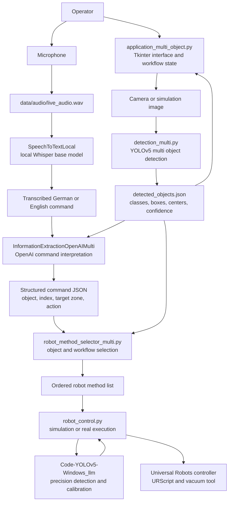
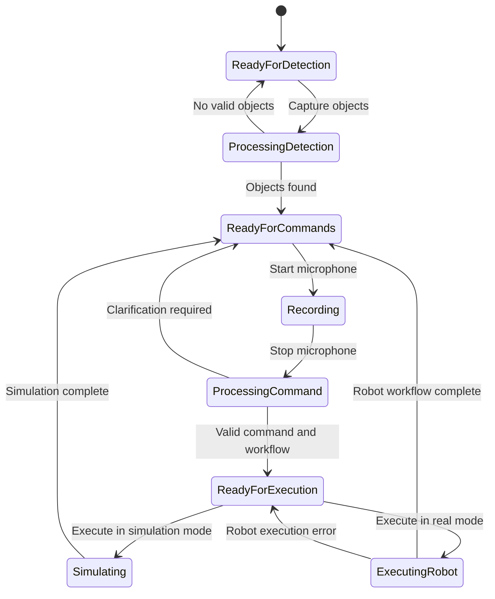
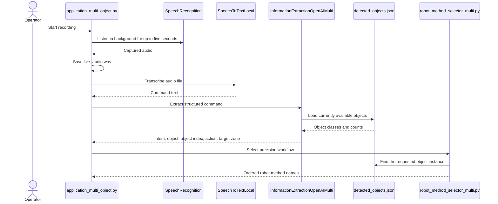
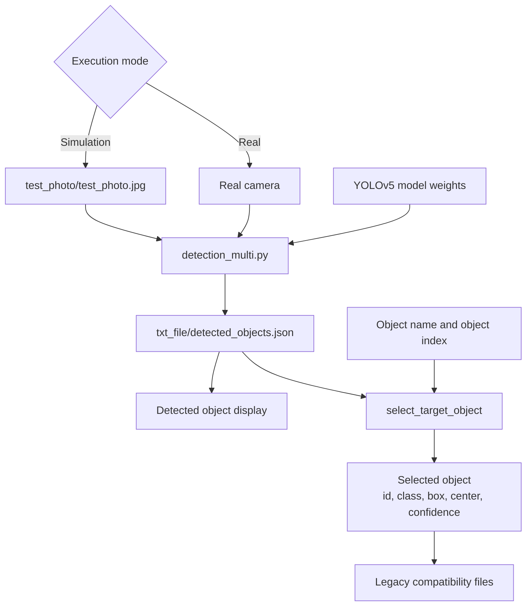
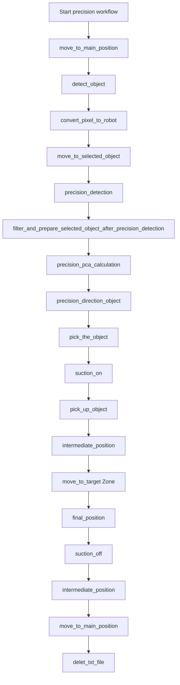
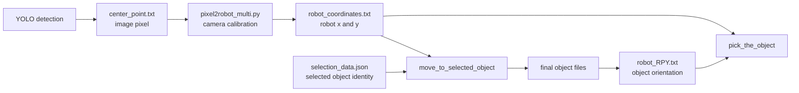
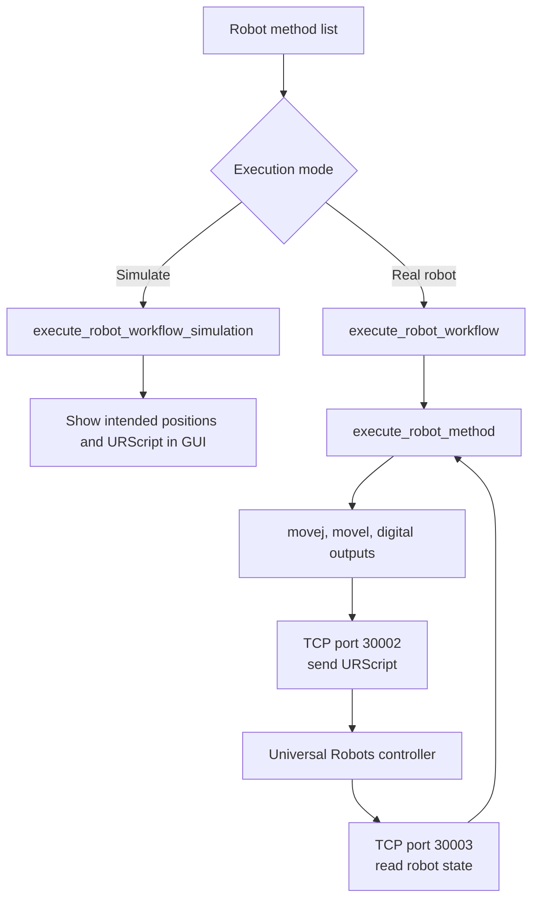
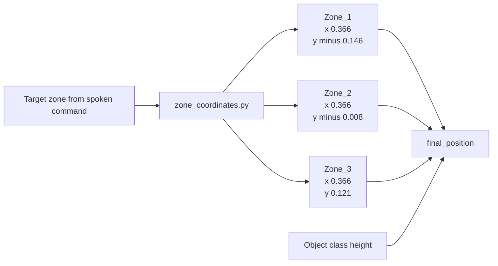
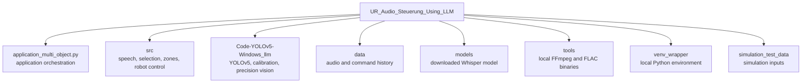

# UR Audio Steering Using LLM Architecture

## Purpose

This project lets an operator detect several objects, select one with a spoken command, and move it to a named robot zone.

The application combines five technical areas.

1. A Tkinter desktop interface
2. YOLOv5 object detection
3. Local Whisper speech recognition
4. OpenAI command interpretation
5. Universal Robots motion and vacuum control

## Complete system graph



## Operator workflow



The interface starts in simulation mode. Real robot execution must be selected explicitly in the interface.

## Speech and language model pipeline



### Concrete command example

The operator says:

```text
Bewege den zweiten Marker zu Zone 2
```

Whisper produces text. The OpenAI extractor is expected to return data shaped like this:

```json
{
  "intent": "bewegen",
  "target_location": "Zone_2",
  "action": "greife Marker, bewege zu Zone_2 und lasse los",
  "object": "Marker",
  "object_index": 1,
  "needs_clarification": false,
  "clarification_fields": [],
  "command_type": "new",
  "reference_index": null
}
```

The object index starts at zero. Index `1` therefore selects the second detected Marker.

## Object detection and selection



The detection result contains an array named `objects`. Each object is expected to provide these values.

1. `id` identifies the individual detection
2. `class` is the numerical YOLO class
3. `class_name` is the readable object name
4. `confidence` is the model confidence
5. `bbox` contains the bounding box
6. `center` contains the image center pixel

The application supports Cylinder, Box, and Marker names. German alternatives are translated before object validation.

## Precision robot workflow



The second detection happens after the robot has moved closer to the selected object. It refines object identity, position, and orientation before the picking movement.

## Vision to robot coordinate communication



The `txt_file` directory acts as a compatibility boundary between the newer speech application and the older YOLO and robot scripts.

Important files include:

1. `detected_objects.json` stores all detected objects
2. `selection_data.json` stores the selected object identity
3. `center_point.txt` stores the selected image pixel
4. `label.txt` stores class, box, and confidence data
5. `crop_img_path.txt` points to the selected object crop
6. `robot_coordinates.txt` stores robot coordinates
7. `robot_RPY.txt` stores the picking orientation
8. `final_object_label.txt` stores the refined class
9. `final_object_center_point.txt` stores the refined center
10. `final_object_crop_path.txt` points to the refined crop

## Simulation and real robot paths



Simulation mode does not open a robot socket. It prints the movement and URScript that would have been sent.

Real mode sends URScript to port `30002`. Robot position and joint feedback are read through port `30003`.

The configured robot address is:

```text
192.168.2.180
```

## Robot zones



The final `z` value depends on the detected object class.

1. Cylinder class `0` uses `0.067` metres
2. Box class `1` uses `0.048` metres
3. Marker class `2` uses `0.040` metres

## Core file responsibilities

### `application_multi_object.py`

This is the main entry point and desktop interface.

It controls workflow state, object detection, microphone recording, transcription, OpenAI extraction, object selection, command history, simulation selection, and real robot execution.

### `src/speech/base.py`

This defines the abstract interfaces for speech transcription and information extraction.

### `src/speech/speech_to_text_local.py`

This loads the local Whisper `base` model and converts a recorded WAV file into text. It configures FFmpeg when the command is not already available.

### `src/speech/information_extraction_openai_api_multi.py`

This sends the transcript and detected object context to the OpenAI API. It returns structured command information, validates object availability, supports German and English names, requests clarification when data is missing, and stores up to five recent commands.

### `src/robot_method_selector_multi.py`

This selects the requested object instance and creates the ordered precision workflow. Dangerous intents and unknown zones produce an empty method list.

### `src/robot_control.py`

This is the robot execution layer. It contains simulation behavior, URScript generation, socket communication, robot feedback reads, vacuum control, movement functions, precision detection calls, coordinate conversion, object orientation, method dispatch, and complete workflow execution.

### `src/zone_coordinates.py`

This maps named zones to robot coordinates and maps object classes to placement heights.

### `Code-YOLOv5-Windows_llm`

This is the legacy vision and calibration subproject. The main application starts its detection scripts and exchanges data through its `txt_file` directory.

Its most important integration scripts are:

1. `detection_multi.py` detects all visible objects
2. `detection_multi_precision_run.py` performs the closer second detection
3. `pixel2robot_multi.py` converts selected pixels into robot coordinates
4. `pca_multi.py` estimates object geometry
5. `direction_multi.py` calculates the picking orientation
6. `function_pool.py` contains camera and robot calibration mathematics
7. `yolov5/detect_multi_objects.py` performs the modified YOLOv5 inference

### `requirements.txt`

This declares Whisper, SpeechRecognition, PyAudio, OpenAI, and dotenv dependencies for the top level application.

### `.env`

This supplies the `OPENAI_API_KEY`. The extractor stops during import when this value is missing.

### `ip_roboter.txt`

This records the intended Universal Robots address. The interface currently also provides the same address as its default editable value.

### `run_guide.txt`

This records the Windows startup procedure, camera permission requirement, robot address check, and local FFmpeg path command.

## Folder ownership



The source of truth for application behavior is the top level application plus `src`. The legacy folder owns object detection and camera to robot calculations. Model files, generated audio, environments, logs, and tool binaries are runtime support rather than application source.

## Main integration boundaries

1. The microphone boundary produces a WAV file
2. The Whisper boundary produces plain text
3. The OpenAI boundary produces structured command data
4. The YOLO boundary produces detected object JSON
5. The selector boundary produces method names
6. The calibration boundary produces robot coordinates
7. The robot boundary accepts URScript and returns robot state

Keeping these boundaries explicit makes it possible to replace Whisper, OpenAI, YOLOv5, or the Universal Robots interface independently.
