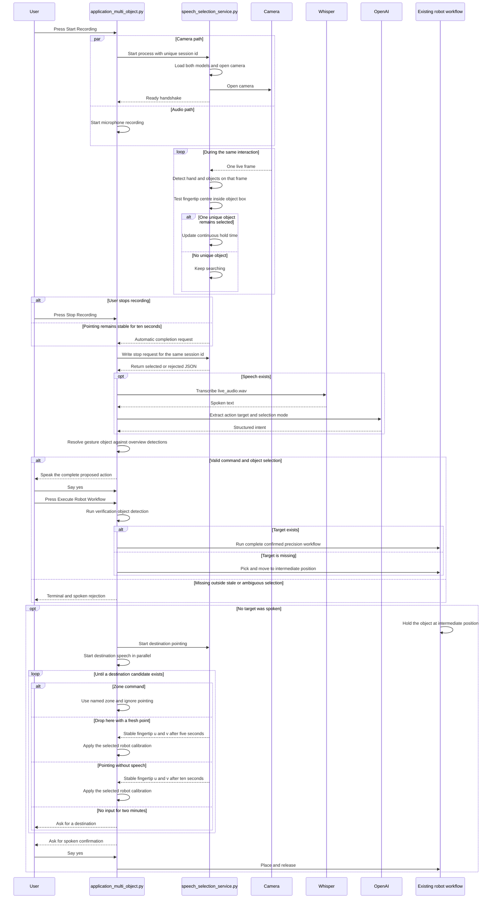
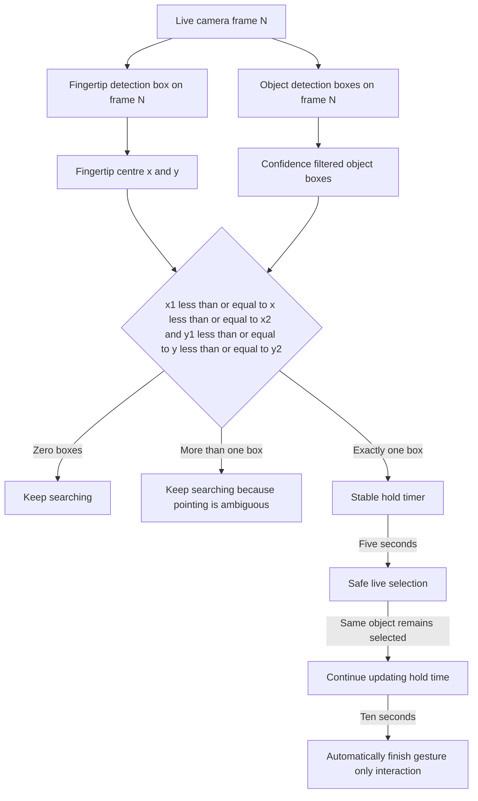

# Multimodal speech and gesture pipeline

## Goal

The operator can speak a robot action, point at an object, or use both at the same time. A pointing selection is accepted only when the centre of the detected fingertip box is inside exactly one detected object box. Speech can supply the action, object name, and target zone. Gesture can supply the object identity or a destination point.

## Complete pipeline

```mermaid
flowchart TD
    A["Capture and Detect Objects"] --> B["Overview detected_objects.json"]
    B --> C["Start Recording"]
    C --> D["Microphone starts"]
    C --> E["Gesture subprocess starts at the same time"]
    E --> F["Camera stays active until the interaction finishes"]
    F --> G["Gesture model detects pointing finger and fingertip box"]
    F --> H["YOLOv5 detects object boxes on the same frame"]
    G --> I["Calculate fingertip box centre"]
    H --> J["Keep confident object boxes"]
    I --> K{"Centre inside exactly one object box"}
    J --> K
    K -->|"No"| F
    K -->|"Yes"| L["Hold the same object"]
    L --> M["After five seconds write a safe live selection JSON"]
    M --> N{"How the interaction finishes"}
    D --> N
    N -->|"User stops recording"| O["Stop microphone and camera"]
    N -->|"Same object held ten seconds"| O
    O --> P{"Speech was captured"}
    P -->|"Yes"| Q["Whisper converts audio to text"]
    Q --> R["OpenAI extracts action target object and selection mode"]
    P -->|"No"| S0{"Point held for ten seconds"}
    S0 -->|"No"| BLOCK
    S0 -->|"Yes"| S["Create a gesture only pick request"]
    R --> T{"Object selection source"}
    S --> U["Use the pointed live object"]
    T -->|"Named object in speech"| V["Use the named overview object"]
    T -->|"This object or pointing reference"| U
    U --> W["Require fresh live result and unique class geometry match"]
    B --> W
    W --> X{"Safe unique match"}
    X -->|"No"| REJECT["Print and speak rejection"]
    REJECT --> BLOCK["Robot execution remains blocked"]
    X -->|"Yes"| Y["Write selection_data.json"]
    V --> V0{"Named object and index available"}
    V0 -->|"No"| REJECT
    V0 -->|"Yes"| Y
    Y --> Z{"Target zone already spoken"}
    Z -->|"Yes"| AA["Speak complete pick and place proposal"]
    Z -->|"No"| AB["Speak pick proposal"]
    AA --> AC{"Spoken yes received"}
    AB --> AC
    AC -->|"No or silence"| BLOCK
    AC -->|"Yes"| AD["Enable Execute Robot Workflow"]
    AD --> AE["Run verification object detection again"]
    AE --> AF{"At least one object detected"}
    AF -->|"No"| BLOCK
    AF -->|"Yes and target known"| AG["Run complete precision pick intermediate place release workflow"]
    AF -->|"Yes and target missing"| AH["Run precision pick workflow and wait at intermediate position"]
    AH --> AI["Start destination microphone and camera in parallel"]
    AI --> AJ{"Destination input"}
    AJ -->|"Zone spoken"| AK["Use named zone and ignore fingertip"]
    AJ -->|"Drop here and fresh three second point"| AL["Use fingertip u and v"]
    AJ -->|"Point held ten seconds without speech"| AL
    AJ -->|"Nothing for two minutes"| AM["Speak destination reminder"]
    AM --> AI
    AL --> AN["Selected robot calibration converts u and v to x and y"]
    AN --> AO["Use object class placement height for z"]
    AK --> AP["Speak destination confirmation"]
    AO --> AP
    AP --> AQ{"Spoken yes received"}
    AQ -->|"No or silence"| AI
    AQ -->|"Yes"| AR["Move to destination release return and clean runtime files"]
    AG --> END["Workflow complete"]
    AR --> END
```



## Runtime sequence



## Same frame accuracy rule



The camera image is not mirrored. Mirroring would move the fingertip to the opposite side while the robot overview coordinates remain unchanged.

## Object identity matching

The live gesture process creates temporary tracking IDs. The robot uses the IDs from the earlier overview detection. The integration therefore performs these checks in order.

1. The live selected class must exist in `detected_objects.json`.

2. The live box and overview boxes are normalized by their own image width and height.

3. Candidates are ranked using normalized box overlap and normalized centre distance.

4. A weak spatial match is rejected.

5. Two nearly equal matches are rejected as ambiguous.

6. Only the unique overview object ID is written to `selection_data.json`.

## JSON subprocess contract

```json
{
  "schema_version": "1.0",
  "session_id": "unique speech session id",
  "status": "selected",
  "reason": "selected",
  "safe_to_use": true,
  "selection_kind": "object",
  "selected_at_unix_s": 1787500000.0,
  "last_seen_at_unix_s": 1787500003.2,
  "frame_index": 42,
  "frame_width": 1280,
  "frame_height": 720,
  "fingertip_pixel": [610.5, 420.0],
  "fingertip_confidence": 0.91,
  "pointing_finger_present": true,
  "objects_considered": 2,
  "hold_seconds": 3.2,
  "selected_object": {
    "live_object_id": "obj_003",
    "class_name": "Cylinder",
    "confidence": 0.96,
    "bbox": [540.0, 330.0, 710.0, 610.0],
    "center": [625.0, 470.0]
  }
}
```

`safe_to_use` must be true. The session ID must match the audio recording session. The schema version must be `1.0`. The last observation must still be fresh when the result is used. Any mismatch blocks execution.

## File responsibilities

`Code/gesture_selection_system/pipeline/run/speech_selection_service.py` owns the live camera session and returns a safe object selection or destination point result.

`Code/gesture_selection_system/pipeline/detection/gesture_detector.py` loads the trained hand gesture model and returns the pointing finger and fingertip boxes.

`Code/gesture_selection_system/pipeline/detection/object_detector.py` loads the existing audio pipeline YOLOv5 model and detects objects on the same live frame.

`Code/gesture_selection_system/pipeline/logic/fingertip_selection.py` calculates the fingertip centre and performs strict box containment.

`src/multimodal/gesture_client.py` starts and stops the gesture subprocess beside audio recording.

`src/multimodal/selection.py` recognizes pointing language and matches the live selected object to the overview detection list.

`src/multimodal/feedback.py` prints rejection messages and speaks them through macOS `say` or Linux `spd-say`.

`application_multi_object.py` coordinates Whisper, OpenAI, gesture resolution, selection data, and the existing robot workflow.

## Speech behaviour

`Pick up this object and move it to Zone 2` uses gesture for the object and speech for the action and target.

`Pick up` uses gesture for the object. After confirmation the robot picks the object and waits at the intermediate position for a destination.

`Pick up the second cylinder and move it to Zone 2` keeps the existing speech only object selection path.

`Drop at Zone 2` uses the taught Zone 2 coordinates and ignores pointing.

`Drop here` uses the current fingertip pixel. Universal Robot applies its existing calibration matrix. Franka applies its original Franka calibration matrix. Both use the selected object class to set the existing placement height.

## Command destination policy

The earlier validation required a destination for every command. This incorrectly marked `Pick up the cylinder` as incomplete even though the robot can pick the object, move to the intermediate position, and request the destination afterward.

The corrected policy separates pickup commands from transfer commands.

| Spoken command | Destination required now | Result |
| --- | --- | --- |
| `Pick up the cylinder` | No | Pick after confirmation, then wait at the intermediate position |
| `Pick up this object` | No | Resolve the pointed object, ask for confirmation, then pick |
| `Move the cylinder` | Yes | Ask which destination should be used |
| `Move the cylinder to Zone 2` | Yes and supplied | Run the confirmed pick and place workflow |

This rule is included in both OpenAI prompts and is enforced again by deterministic Python validation. The Python rule remains authoritative if the model returns inconsistent clarification fields.

## Franka gesture only execution correction

The gesture only workflow previously reached Franka precision detection and then stopped with `name 'os' is not defined`. The workflow uses `os.environ` to select Franka perception temporarily, but its module did not import the Python `os` library. The required import is now present. Gesture selection, spoken confirmation, robot calibration, and movement order are unchanged.

## Franka real camera alignment

The original Franka calibration converts a sensor pixel with `calibration x = image width minus sensor x`. The integrated transformer applies this same conversion through `mirror_x` before calling the original pixel transformation.

The first movement positions the camera above the selected object for precision detection. Its configured correction is derived from `output_c2f.json` and the downward Franka orientation used by the workflow.

| Axis | Flange correction |
| --- | --- |
| X | negative 0.056249852 metres |
| Y | negative 0.009568764 metres |
| Z | negative 0.031028437 metres |

The earlier positive 0.084 metre X value belonged to the temporary Universal Robot alignment assumption and is no longer used for Franka. Precision perception subprocesses use the active project Python environment rather than a nested environment inside the detection folder.

## Safety result

No robot method list is accepted when the gesture result is missing or stale, pointing does not identify one object, confidence is too low, the live object is absent from the overview list, the overview match is ambiguous, spoken yes is missing, verification detection fails, or the session contract is invalid.
