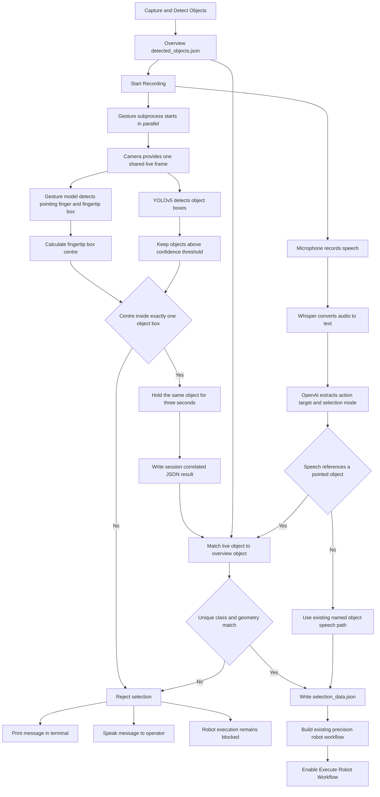
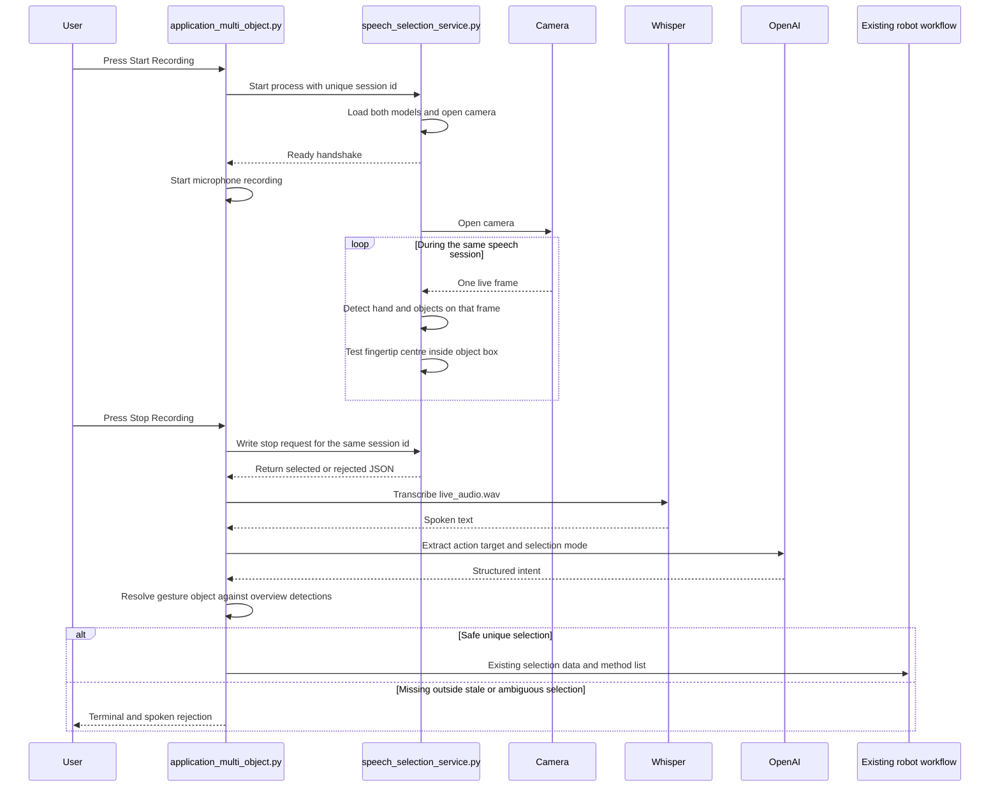
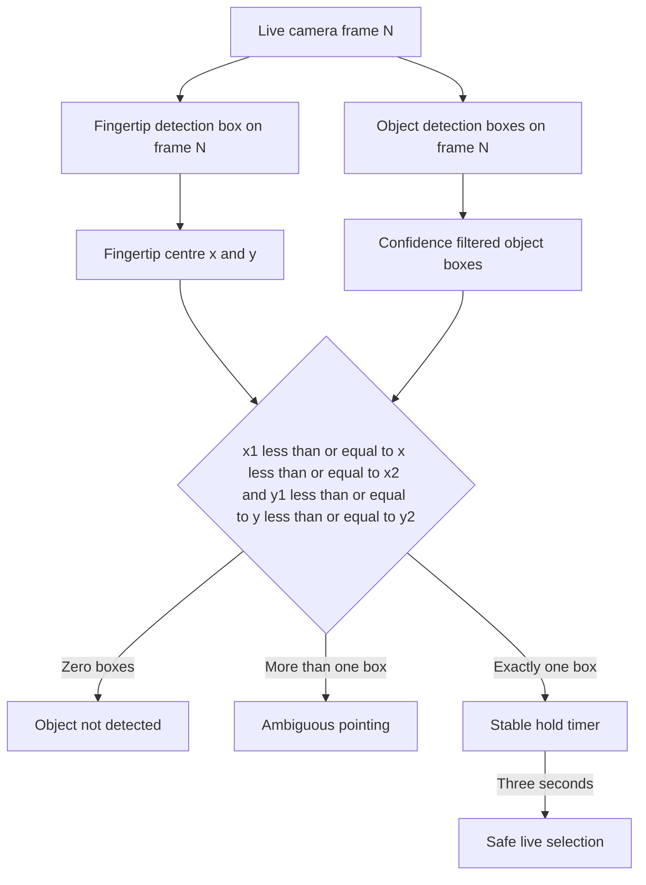

# Multimodal speech and gesture pipeline

## Goal

The operator speaks a robot action while pointing at an object. The system selects the object only when the centre of the detected fingertip box is inside exactly one detected object box. Speech supplies the action and target zone. Gesture supplies the object identity.

## Complete pipeline



## Runtime sequence



## Same frame accuracy rule



The camera image is not mirrored. Mirroring would move the fingertip to the opposite side while the robot overview coordinates remain unchanged.

## Object identity matching

The live gesture process creates temporary tracking IDs. The robot uses the IDs from the earlier overview detection. The integration therefore performs these checks in order.

1. The live selected class must exist in `detected_objects.json`.

2. The live box and overview boxes are normalized by their own image width and height.

3. Candidates are ranked using normalized box overlap and normalized centre distance.

4. A weak spatial match is rejected.

5. Two nearly equal matches are rejected as ambiguous.

6. Only the unique overview object ID is written to `selection_data.json`.

## JSON subprocess contract

```json
{
  "schema_version": "1.0",
  "session_id": "unique speech session id",
  "status": "selected",
  "reason": "selected",
  "safe_to_use": true,
  "selected_at_unix_s": 1787500000.0,
  "frame_index": 42,
  "frame_width": 1280,
  "frame_height": 720,
  "fingertip_pixel": [610.5, 420.0],
  "fingertip_confidence": 0.91,
  "pointing_finger_present": true,
  "objects_considered": 2,
  "selected_object": {
    "live_object_id": "obj_003",
    "class_name": "Cylinder",
    "confidence": 0.96,
    "bbox": [540.0, 330.0, 710.0, 610.0],
    "center": [625.0, 470.0]
  }
}
```

`safe_to_use` must be true. The session ID must match the audio recording session. The schema version must be `1.0`. Any mismatch blocks execution.

## File responsibilities

`Code/gesture_selection_system/pipeline/run/speech_selection_service.py` owns the live camera session and returns one safe selection result.

`Code/gesture_selection_system/pipeline/detection/gesture_detector.py` loads the trained hand gesture model and returns the pointing finger and fingertip boxes.

`Code/gesture_selection_system/pipeline/detection/object_detector.py` loads the existing audio pipeline YOLOv5 model and detects objects on the same live frame.

`Code/gesture_selection_system/pipeline/logic/fingertip_selection.py` calculates the fingertip centre and performs strict box containment.

`src/multimodal/gesture_client.py` starts and stops the gesture subprocess beside audio recording.

`src/multimodal/selection.py` recognizes pointing language and matches the live selected object to the overview detection list.

`src/multimodal/feedback.py` prints rejection messages and speaks them through macOS `say` or Linux `spd-say`.

`application_multi_object.py` coordinates Whisper, OpenAI, gesture resolution, selection data, and the existing robot workflow.

## Speech behaviour

`Pick up this object and move it to Zone 2` uses gesture for the object and speech for the action and target.

`Pick up` uses gesture for the object. The existing command logic still asks for a target zone before it builds a pick and place workflow.

`Pick up the second cylinder and move it to Zone 2` keeps the existing speech only object selection path.

## Safety result

No robot method list is accepted when pointing is outside every box, gesture confidence is too low, object confidence is too low, more than one live box contains the fingertip, the live object is absent from the overview list, the overview match is ambiguous, the subprocess result is missing, or the session contract is invalid.
