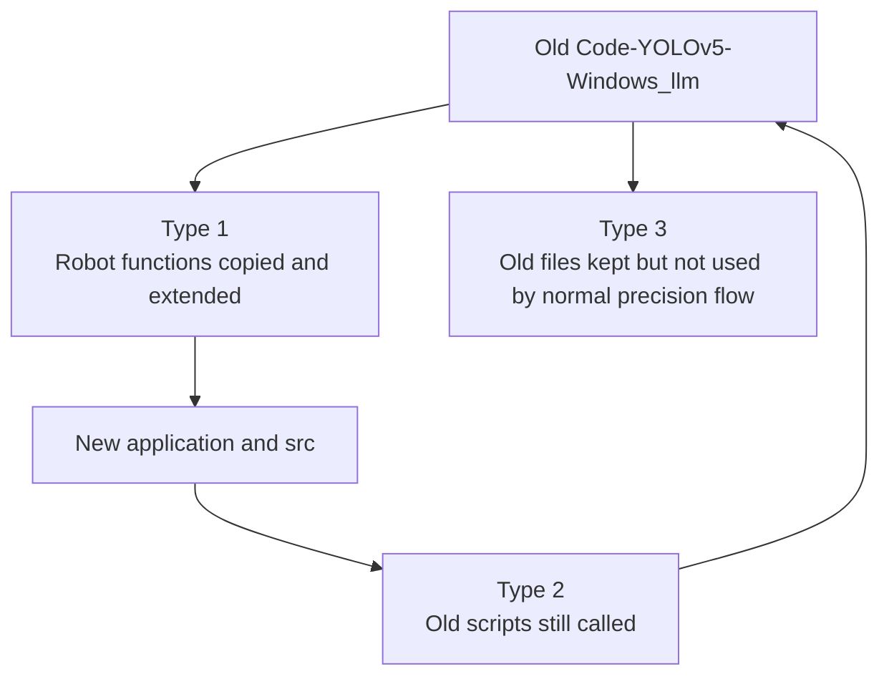
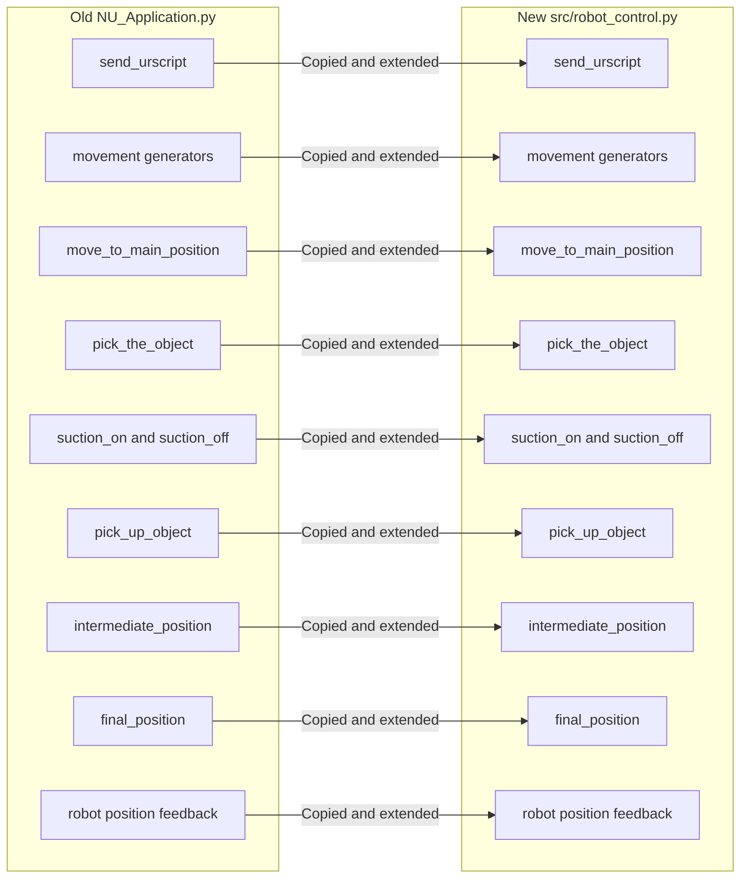
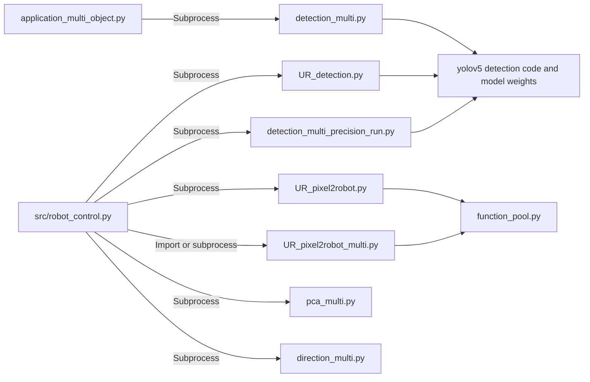
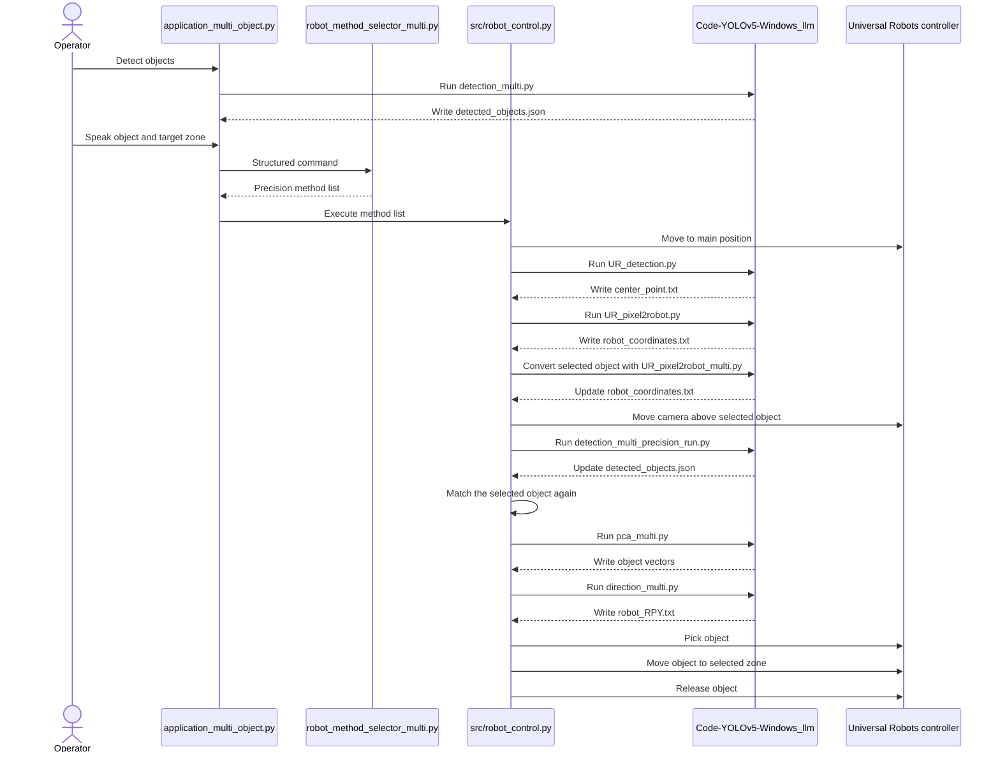
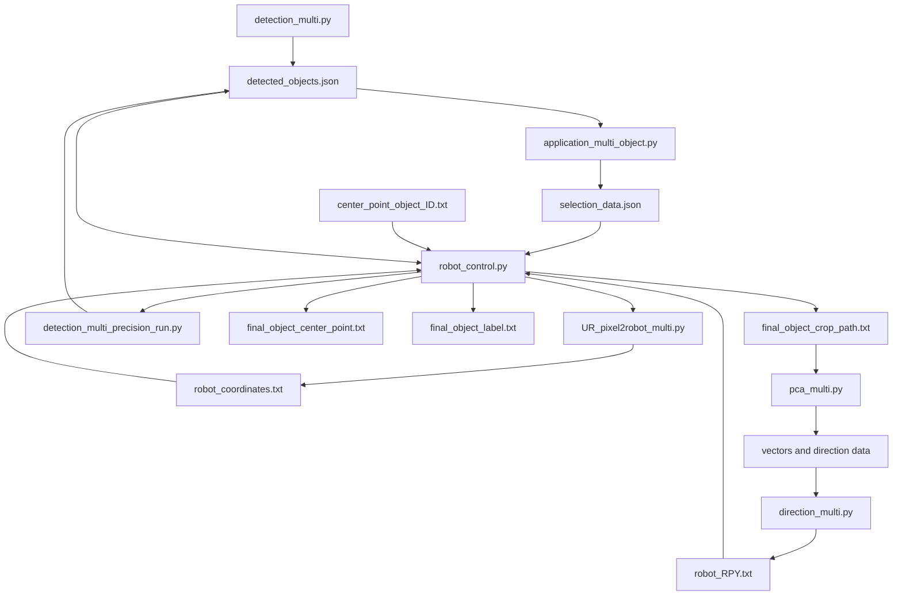
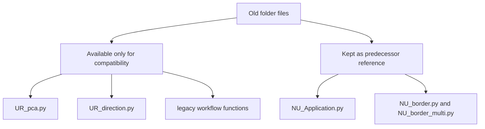
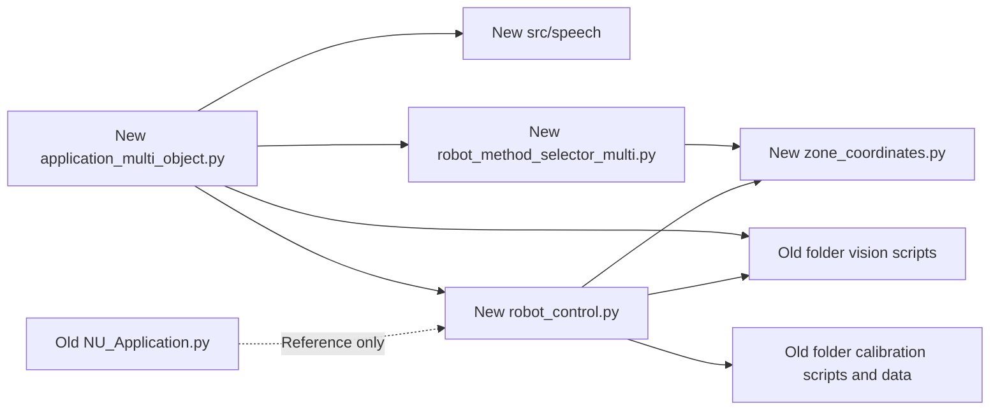

# Old and New Script Communication

## Meaning of old and new

The old code is stored inside:

```text
Code-YOLOv5-Windows_llm
```

The new code is stored mainly inside:

```text
application_multi_object.py
src
```

The word old describes where the code originally came from. The old folder is now physically located inside the newer project.

## Three types of reuse



The system does not use one single communication method.

1. Some robot functions were copied into the new controller
2. Some old scripts are still executed by the new controller
3. Some old files are retained only for compatibility, training, experiments, or reference

## Type 1 copied robot logic

The old `NU_Application.py` is not executed by the normal current workflow. Its main robot functions were copied and extended inside `src/robot_control.py`.



There is no live connection between these copied functions.

If `move_to_main_position` changes inside old `NU_Application.py`, the new `robot_control.py` does not change automatically.

The current robot uses the copy inside `src/robot_control.py`.

## New robot capabilities

The new controller adds functions that the old controller did not provide in the same form.

```mermaid
flowchart TD
    NewController["src/robot_control.py"]
    Simulation["simulation mode"]
    SelectedObject["move_to_selected_object"]
    MultiConversion["convert_pixel_to_robot_multi"]
    PrecisionDetection["precision_detection"]
    ObjectFilter["filter selected object after second detection"]
    PrecisionPCA["precision_pca_calculation"]
    PrecisionDirection["precision_direction_object"]
    Dispatcher["execute_robot_method"]
    Workflow["execute_robot_workflow"]
    Zones["speech selected target zones"]

    NewController --> Simulation
    NewController --> SelectedObject
    NewController --> MultiConversion
    NewController --> PrecisionDetection
    NewController --> ObjectFilter
    NewController --> PrecisionPCA
    NewController --> PrecisionDirection
    NewController --> Dispatcher
    NewController --> Workflow
    NewController --> Zones
```



## Type 2 old scripts that are still called

These scripts remain active in the normal current precision workflow.



### Meaning of subprocess

A subprocess starts another Python file as a separate program.

The new controller performs an action similar to:

```python
subprocess.run([PRE_PYTHON, old_script], cwd=PREDECESSOR_DIR)
```

The sequence is:

```text
New function starts
Old Python script runs
New function waits
Old script finishes
New function continues
```

### Meaning of direct import

`convert_pixel_to_robot_multi` first attempts this direct function call:

```python
import pixel2robot_multi
x_robot, y_robot = pixel2robot_multi.convert_coordinates(pixel_x, pixel_y)
```

If the direct import fails, it starts `UR_pixel2robot_multi.py` as a subprocess with the two pixel values.

## Complete current precision flow



## Communication through shared files

Most old scripts do not return a Python value directly to the new controller. They exchange data through files in `Code-YOLOv5-Windows_llm/txt_file`.



## Concrete example

The operator says:

```text
Move the second Marker to Zone 2
```

The communication is:

1. `detection_multi.py` finds several objects
2. It writes the objects into `detected_objects.json`
3. The new application selects Marker index `1`
4. The new application writes the selected object identity into `selection_data.json`
5. `robot_control.py` reads its pixel center, for example `1530, 696`
6. `UR_pixel2robot_multi.py` converts that pixel into robot coordinates
7. It writes values such as `x 0.375` and `y minus 0.055` into `robot_coordinates.txt`
8. `robot_control.py` reads those values and moves the camera above the Marker
9. `detection_multi_precision_run.py` detects the object again at close range
10. `pca_multi.py` and `direction_multi.py` calculate its final orientation
11. `robot_control.py` picks the Marker
12. `zone_coordinates.py` supplies Zone 2 values
13. The final robot target becomes `x 0.366`, `y minus 0.008`, and Marker height `z 0.040`

## Remaining compatibility files



### Old `NU_Application.py`

The current entry point does not run or import this file.

Its movement logic was copied and extended inside `src/robot_control.py`.

The file remains useful as a predecessor reference. It becomes active only if somebody runs it manually.

### Old `UR_pca.py` and `UR_direction.py`

The current precision workflow uses `pca_multi.py` and `direction_multi.py`.

The single object versions remain callable through compatibility functions but are not selected by the normal precision method list.

The unrelated model training package, scaffolding scripts, diagnostic scripts, and standalone gesture runner were removed during folder cleanup. They were not called by the multimodal application.

## Current ownership summary



The current system has one active main application and one active robot controller.

```text
Main application
application_multi_object.py

Robot controller
src/robot_control.py
```

The old folder remains active for vision and calibration, but the old `NU_Application.py` is no longer the current controller.
